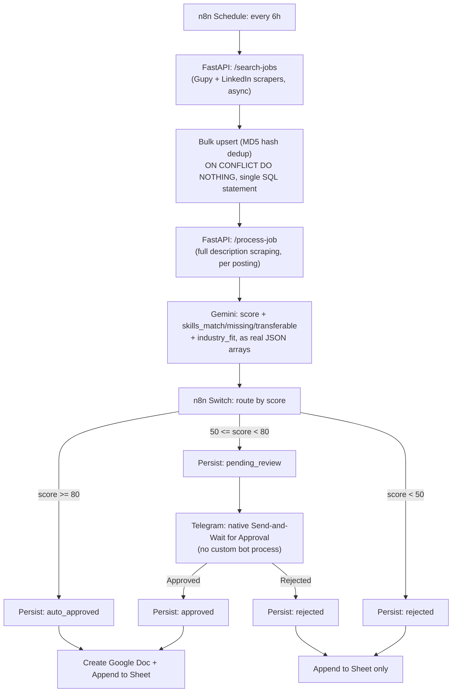
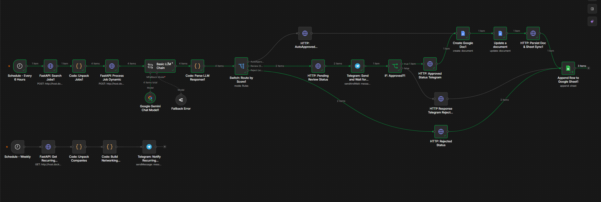
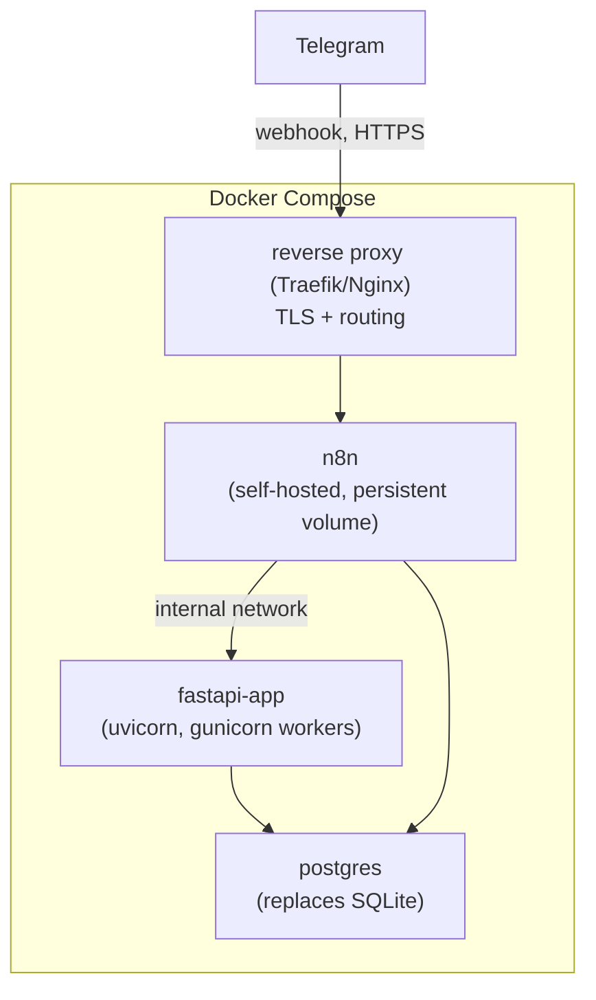

# JobApplicationIASystem

**An autonomous, human-in-the-loop job application pipeline** — built with FastAPI, n8n, and Google Gemini(LlMs), designed to discover, evaluate, and triage job postings against a canonical résumé, without either fully automating a decision that deserves human judgment or requiring me to manually screen every posting.

This isn't a toy project. It's a system I actually use, and it's also a deliberate exercise in building software the way I'd want to build it professionally: with dependency inversion, layered architecture, tests that catch real regressions, and — just as importantly — the discipline to **not** add infrastructure I don't need yet.

---

## Why this exists

Job searching at scale is a filtering problem before it's an applying problem. Manually checking dozens of postings a day against my own résumé doesn't scale, and blindly auto-applying to anything above a score threshold throws away judgment I actually want to keep in the loop. This system sits in between: it does the tedious discovery and first-pass evaluation automatically, and asks me for a decision only when the decision is genuinely ambiguous.

It's also, candidly, a portfolio piece. Every architectural decision below was debated, sometimes reversed, and documented — including the ones where the first instinct (mine or an AI pair-programmer's) turned out to be over-engineered for the actual scale of the problem.

---

## Architecture — current state


---

## N8N Workflow - Orchestrator


---

**Data model:** jobs are deduplicated via an MD5 hash of `(source_platform, job_id)` **before** any Gemini call — the dedup layer exists specifically so the same posting is never scored twice by the LLM. Skills (`match`/`missing`/`transferable`) are normalized into a proper dimension table (`skills` + `job_record_skills`), not stored as CSV strings, so they can actually be aggregated later (e.g. "what am I missing most often across rejected postings") without manual string parsing.

---

## The Four Pillars

| Pillar | Status | What it does |
|---|---|---|
| **1 — Deduplication & Persistence** | ✅ Shipped | SQLModel (SQLite dev / PostgreSQL prod) layer, MD5-hash dedup before LLM calls, bulk upsert (single `INSERT ... ON CONFLICT DO NOTHING ... RETURNING` per batch instead of N round-trips), normalized skills schema |
| **2 — Human-in-the-Loop (Telegram)** | ✅ Shipped | Fully visual in n8n: a `Switch` node routes by score, and the native **Telegram "Send and Wait for Approval"** node pauses the workflow execution itself — no custom bot process, no polling, no callback server. Python's only role is a single `POST /jobs/{hash}/status` endpoint that persists whatever decision n8n reports |
| **3 — Multi-Profile Engine** | 📝 Documented, deferred | See [below](#pillar-3--multi-profile-engine-deferred-by-design) — reconsidered as unnecessary in its original form |
| **4 — Containerization & 24/7 Deployment** | 📝 Documented, not yet built | See [below](#pillar-4--containerization-plan-docker-compose) |

---

## Key Engineering Decisions (and reversals)

This section exists because the interesting part of building this wasn't writing the CRUD — it was catching over-engineering (mine and my AI pair-programmer's) before it shipped.

- **Dedup before the LLM call, not after.** The whole point of persisting a job hash isn't the database row — it's making sure a posting seen in a previous 6-hour cycle never triggers a second, paid Gemini call.
- **A real regression bug taught a real lesson about tests.** An early version had `job_id`/`job_url` swapped in a scraper call. The existing unit tests didn't catch it because the mock accepted any argument order — they asserted on the *return value*, not on *how the mock was called*. Fixed by adding tests that assert exact call arguments, which is now a standing practice, not a one-off patch.
- **Moved Pillar 2's decision logic from a custom Telegram bot to n8n's native `Send and Wait` node.** The first design had a whole second Python process (`python-telegram-bot`, polling, callback handlers, a `NotificationPort` abstraction). It worked, but it duplicated a capability n8n already ships natively. Cutting it removed an entire process, a dependency, and a SQLite-concurrency risk between two processes writing to the same file — for zero functional loss.
- **Explicitly declined Celery + Redis for now.** Both were seriously considered. The conclusion: this workload is I/O-bound, `asyncio` already handles the concurrency that exists, and the real triggers for a message broker (multi-instance fan-out, parallel per-profile evaluation) don't exist yet in this system. Documented as a **conditional roadmap item**, revisited only if a concrete trigger shows up — not implemented preemptively because it's "best practice."
- **1NF violation caught before it shipped.** An early schema stored `skills_missing` as a comma-separated string. That's fine for display, useless for aggregation — and aggregation (`GROUP BY` skill, ordered by frequency) is exactly what a "what am I missing across rejected postings" feature needs. Normalized into a proper `skills` dimension table + a `job_record_skills` association table with a `relation_type` column, before any downstream feature depended on the broken shape.
- **Bulk upsert over row-by-row inserts.** Discovery used to do a `SELECT` (exists check) + `INSERT` + `commit()` per job. Replaced with a single `INSERT ... ON CONFLICT DO NOTHING ... RETURNING *` per batch — one round-trip for the whole cycle, and the `RETURNING` clause doubles as the "which ones were actually new" signal, no separate existence check needed.

---

## Tech Stack

- **API layer:** FastAPI, layered as `api/ → services/ → db/` (routes never touch SQL; services never touch FastAPI/HTTP)
- **Persistence:** SQLModel over SQLite (dev) / PostgreSQL (prod), same `DATABASE_URL`-driven engine for both
- **Scraping:** `httpx` + `BeautifulSoup`, exponential backoff with jitter, rotating user-agents
- **Orchestration:** n8n (self-hosted), owns all business-rule branching visually — score thresholds, HITL, Google Docs/Sheets writes
- **LLM:** Google Gemini via n8n's LangChain nodes, structured JSON output (real arrays, not delimited strings)
- **HITL channel:** Telegram, via n8n's native approval node — no custom bot process
- **Tunneling (current):** ngrok, bridging the self-hosted n8n instance to Telegram's webhook requirements by docker.
- **Tests:** `pytest` + `pytest-asyncio`, unit tests for services (mocked repository/aggregator), integration tests for the repository against SQLite in-memory

---

## Project Structure

```
app/
  api/
    deps.py                 # composition root (DI wiring)
    routes/                 # thin HTTP layer: jobs.py, health.py
  core/
    exceptions.py           # domain exceptions, mapped to HTTP by global handlers
  services/                 # framework-agnostic business logic
    job_discovery_service.py
    job_processing_service.py
    job_status_service.py
    company_radar_service.py
  scraper/
    factory.py               # scraper selection (mock/Gupy/LinkedIn)
    base.py, aggregator.py, parser_html.py
    platforms/gupy.py, linkedin.py
  db/
    models.py                # JobRecord, Skill, JobRecordSkill
    session.py, repository.py
    scripts/
      add_skills_schemes_v1.py
      add_skills_schema_v1.py
  models/
    api.py, job.py           # Pydantic schemas
  config/
    settings.py
workflows/
  Pipeline_Autonomo_de_Vagas_Pilar2_HITL.json   # main pipeline, n8n
  Radar_Empresas_Recorrentes.json               # secondary workflow, reuses persisted data
tests/
  unit/          # services, scraper factory, hashing — no I/O
  integration/   # repository against SQLite in-memory
```

---

## Getting Started

```bash
python -m venv .venv && source .venv/bin/activate   # or .\.venv\Scripts\activate on Windows
pip install -r requirements.txt

cp .env.example .env   # set DATABASE_URL, USE_MOCK, etc.

uvicorn app.main:app --reload --host 0.0.0.0 --port 8000
```

Import `workflows/Pipeline_Autonomo_de_Vagas_Pilar2_HITL.json` into n8n, point the `HTTP Request` nodes at your FastAPI host (`http://host.docker.internal:8000` if n8n runs in Docker), configure the Telegram credential/chat ID on the `Send and Wait` node, and you're running.

```bash
pytest -v                       # full suite
pytest tests/unit -v            # fast, no I/O
pytest tests/integration -v     # SQLite in-memory
```

---

## Roadmap

### Pillar 3 — Multi-Profile Engine (deferred by design)

Originally scoped as: store N canonical résumé profiles, let the pipeline pick/score against the best-matching one per posting. After actually living with the system, that turned out to solve the wrong problem. A **static profile picker** still forces a best-fit compromise; what actually helps is generating a **tailored résumé summary per posting, on demand, from a single canonical source of truth**, using a tightly scoped prompt rather than a menu of pre-written variants. This is both simpler to build and — because the prompt is grounded in one fixed, verified profile — less prone to the model inventing experience that doesn't exist. Revisiting this as: *one canonical profile + on-demand LLM tailoring*, not multi-profile selection. Not built yet; documented here as the corrected direction for whenever it's picked back up.

### Pillar 4 — Containerization Plan (Docker Compose)

Not built yet — documented as the target shape:



Planned changes when this gets built:
- **`DATABASE_URL` → PostgreSQL.** The app already targets this via SQLAlchemy dialect abstraction — no code change needed, just the connection string and adding `psycopg2-binary`.
- **ngrok → reverse proxy with a real TLS certificate.** ngrok is fine for development; a 24/7 deployment needs a stable public endpoint, which means Traefik or Nginx in front of n8n, not a tunnel.
- **Secrets via `.env` + Docker secrets**, not committed anywhere — `TELEGRAM_BOT_TOKEN`/Google OAuth credentials excluded from version control, already the case today via `.gitignore`.
- **Celery + Redis:** intentionally *not* in this diagram. Documented as a conditional next step, triggered only if Pillar 3's eventual on-demand LLM tailoring needs real parallel fan-out, or if the app needs to scale to multiple FastAPI replicas. Not adding it preemptively.

---

## A note on how this was built

Development was paired with Claude throughout — for architecture discussion, code review, and catching blind spots. The most useful parts of that process weren't the code generation; they were the moments of pushing back on a proposal (human or AI-suggested) that solved a problem that didn't actually exist yet at this scale. Several sections above exist specifically because a first design was reconsidered and simplified before it shipped. That's the engineering practice this project is meant to show — not "AI wrote the app," but "here's the reasoning trail for why the app looks the way it does."

---

## License

Personal project, shared for portfolio/demonstration purposes.
